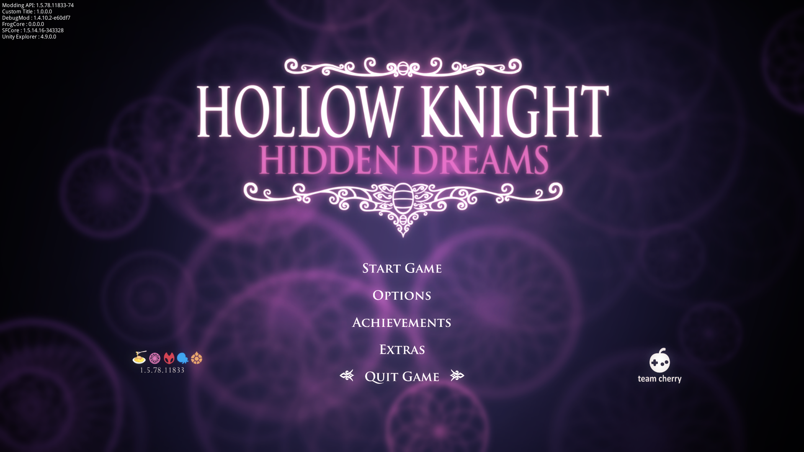
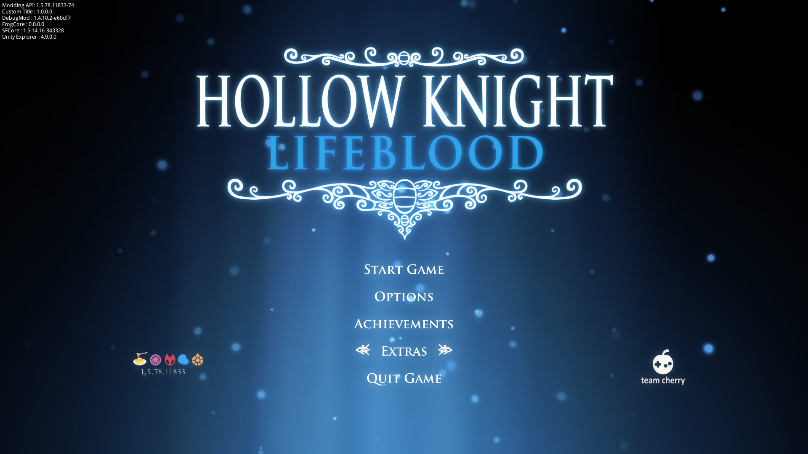

# Custom Title
A Hollow Knight mod that allows players to use their custom title.

# Preview




# Adding your own menu title
1. Go to the mod's data folder of this mod. (Located in `<Hollow Knight Path>/Hollow Knight_Data/Managed/Mods/CustomTitle/data`)
2. Drop your image in there. A high-resolution and transparent background is recommended.
3. Open `data.json` in that folder and write your image file name to the menu style you want to replace. You should understand how it works from the examples I wrote for the DLC menu styles
```
{
    "Classic_Style": "",
    "HD_Style": "dream.png",
    "Grimm_Style": "grimm.png",
    "Modern_Style": "lifeblood.png",
    "Radiant_Style": "",
    "GG_Style": "god.png",
    "Shade_Style": "",
    "Infected_Style": "",
    "Steel_Style": "",
    "Brilliant_Style": "",
    "VHeart_menu_Style": "void.png"
}
```

## Adding custom title for modded menu styles
> Please take note that this method might not work on some mods.

Let's take an example that you want to add a custom title for the menu style of Pale Court mod. Assuming the custom title image file you want to replace is named `mycooltitle.png`
1. Install `Unity Explorer` from Lumafly/Scarab
2. Open the game, switch to the Pale Court menu style. Then press <kbd>F7</kbd> to activate `Unity Explorer`. In the Object Explorer window, find and select `Menu_Styles` -> select the highlighted one in the dropdown and copy its name from the Inspector window


3. Drop your `mycooltitle.png` to the data folder. Then open `data.json` and add a new entry, left one is the name of the menu style and right one is the image filename. Example: 

```
...
    "VHeart_menu_Style": "void.png",
    "Pale_Court_Style_1(Clone)": "mycooltitle.png" 
}
```

4. That's it! Enjoy

# Issues

Yep I know some of the default menu titles are kinda low-quality :)
